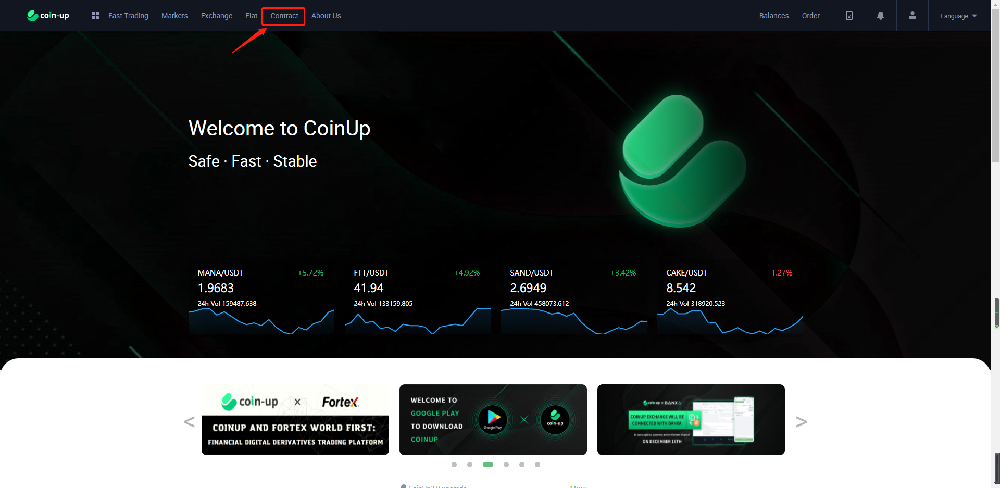
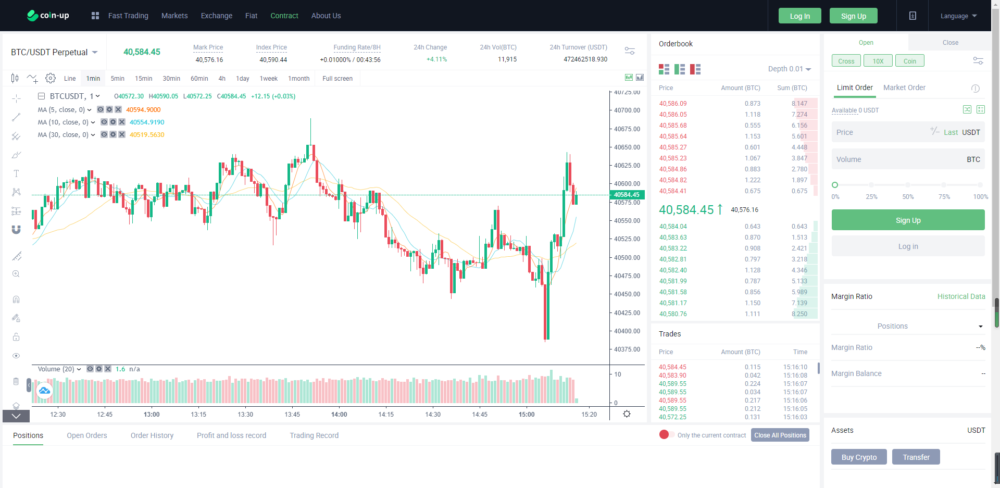
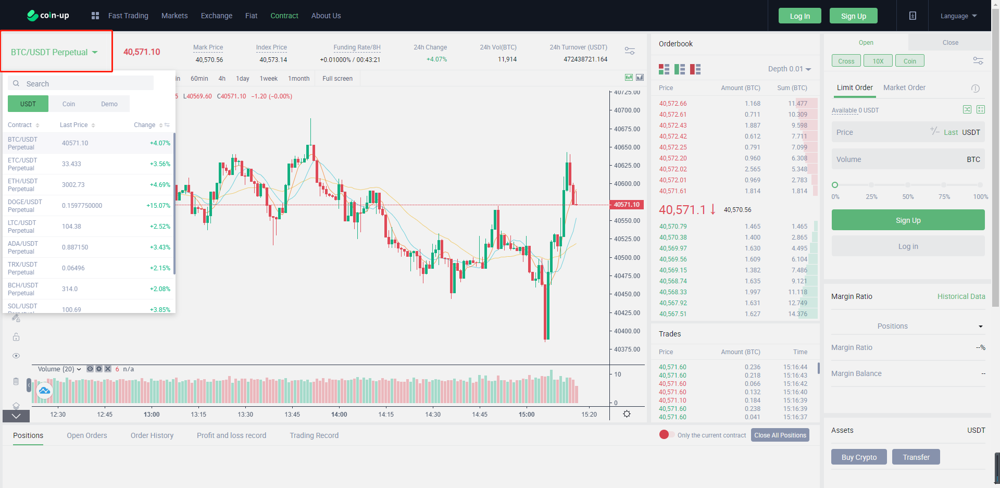
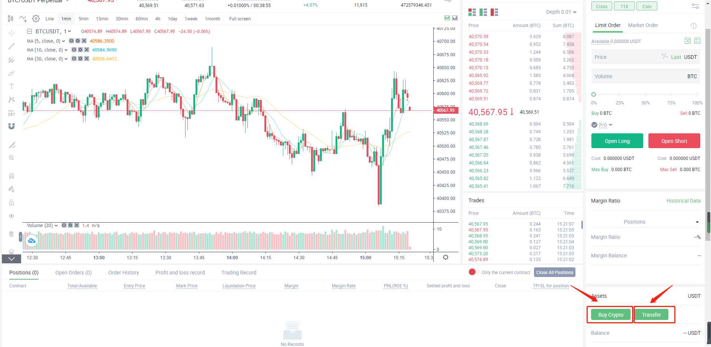
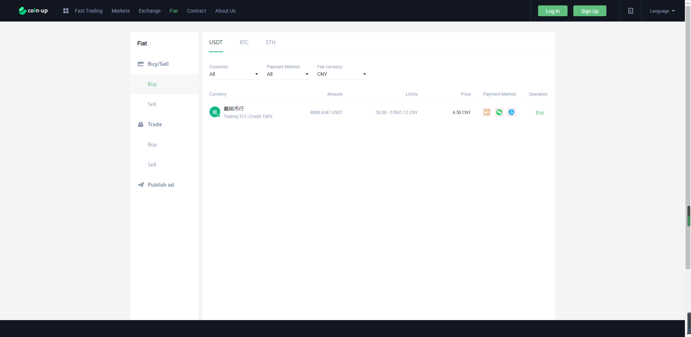
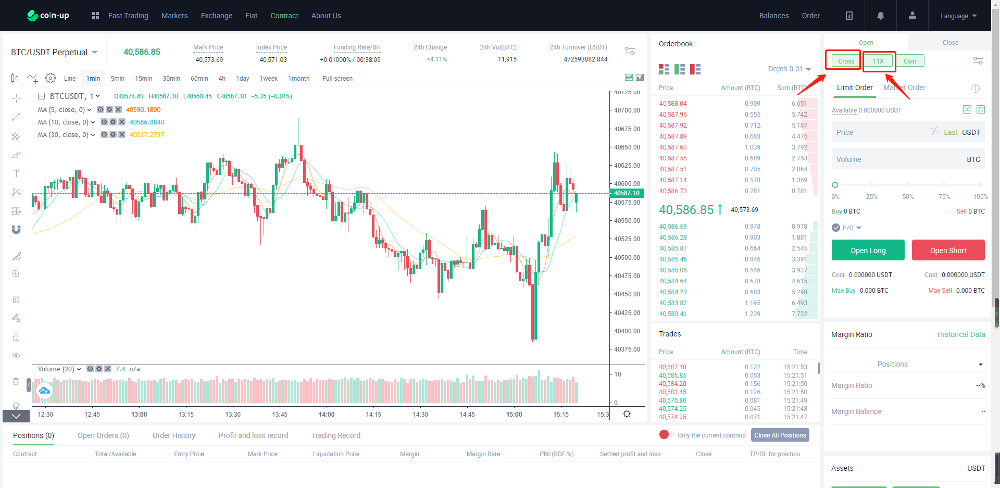
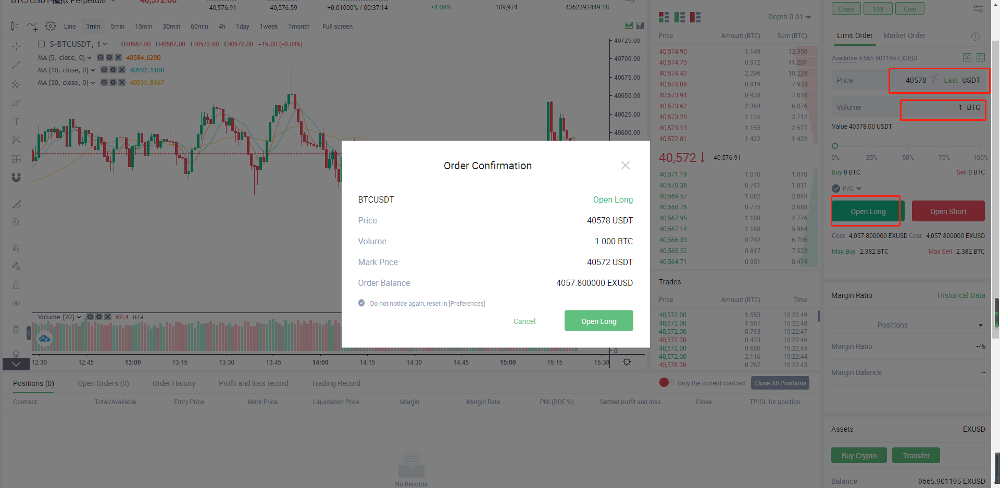
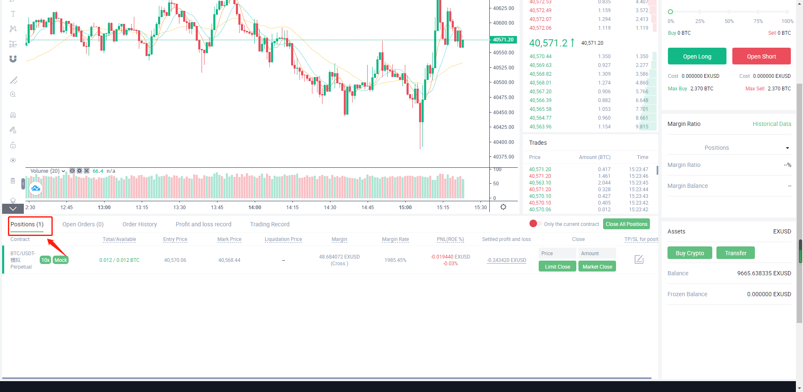
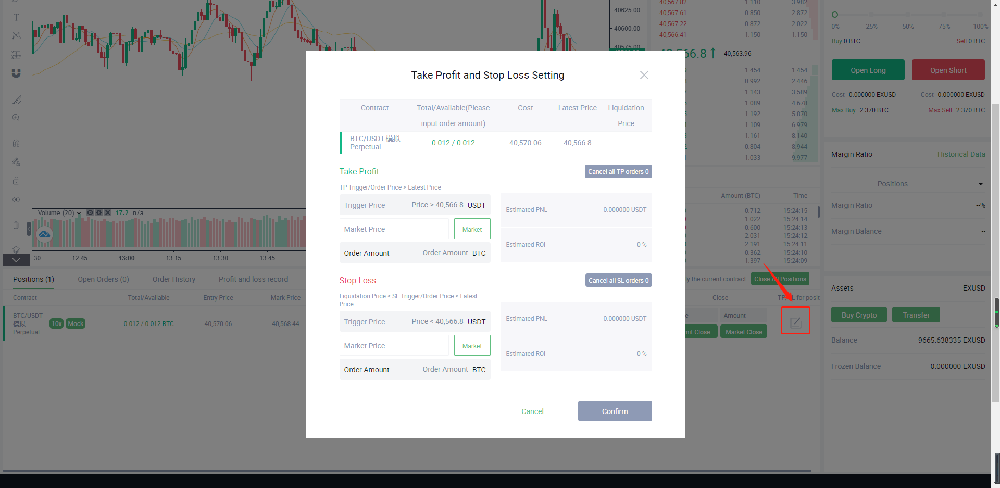
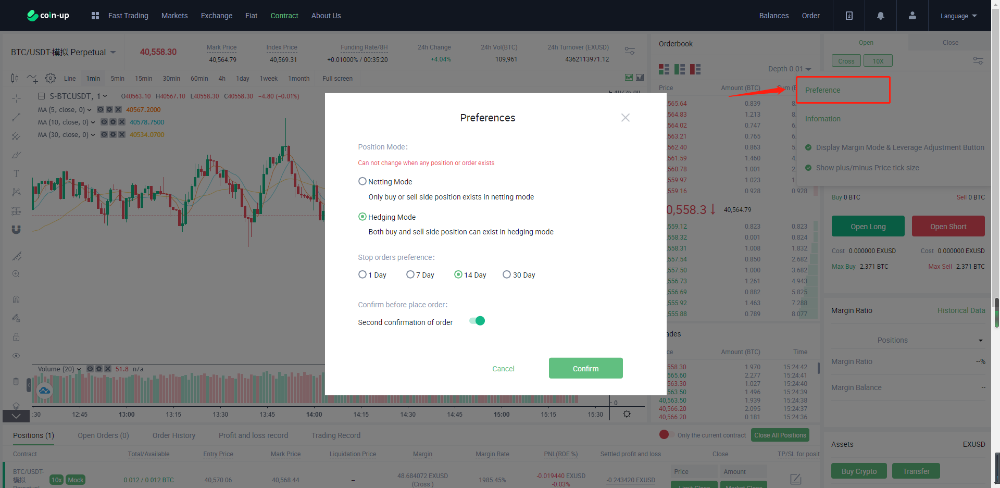

# Perpetual contract user guide

## Ⅰ Enter contract trading

* Click on "Contract" on the home page to go to the Contract Trading page

* Go to the contract trading page and log in to learn about the contents of each setting information, including: contract information, orders submitted, order list, latest transactions, position records, depth charts etc. At the same time, the lower left contract information section, showing the relevant information about the contract, list of common problems in trading and index information, easy to access at any time!

## Ⅱ Trading

**1. Choosing trading pair**

Select the trading pair in the trade pair switching area. Mainly includes USDT contracts, currency-based contracts and Simulation of contract.

**2. Funds transfer**

If there are not enough funds available at present, the funds in the coin account can be transferred to the contract account. If the coin account still does not have funds, it can be recharged or traded in Fiat currency.

**3. Contract setting**

 - Leverage

 A multi-range adjustable leverage multiple is currently available to select up to 125x leverage.

- Full Position

Also known as "cross-term margin", it is the use of all available balances in an account as margin to avoid forced closing. Any other position that has been profitable can help increase margin on a loss-making position. Please note that all positions in the default state are initially set to Full Position Margin.

- Restricted Position

The maximum loss for the user is limited to the starting margin used. When a position is forced to close, no available balance is used to increase the margin of the position. By isolating the margin used in a position, you can limit the loss on that position to the initial guaranteed amount, which can help you if your short-term speculative trading strategy fails. When using restricted position margin, you can select the appropriate leverage. The higher the leverage, the less margin will be used for this position.

**4. Submit Order**

- Limit order

A limit order is the highest or lowest price that a trader uses to specify a buy or sell, and a trader reduces his or her transaction costs by limiting the ordering price. However, if the order price is far from the current market price, then the order may not be confirmed. In a limit order, the user enters the limited order price and the number of positions.

- Market order

A market order is immediately confirmed in the current market, which is selected when a trader needs an emergency deal mandate. Selecting this type is to be noted the order in the list, otherwise a large market-value order may "break through the list" and cause market impact costs. Only the opening value or the number of open positions need to be entered when trading on a market order.

- High-end limit order

> - PO: "Only Maker (Post Only)", will not immediately convert in the market, to ensure that the user is always Maker; If the order is immediately closed with an existing value, then it may be canceled;

> - IOC: "Immediate or Cancel", if your order is set to "Close now and cancel the remaining", any unsold parts will be cancelled immediately;

> - FOK: "Full deal or cancellation immediately (Fill or Kill)", the order will only be completed immediately, otherwise it will be cancelled.

- Buyer Buy Long

If the trader determines that future market prices will rise, then should buy long and buy a fixed number of contracts.

Buy Long is actually buying a contract at the right price, waiting for the market price to rise and then sell (balancing) to earn the difference, similar to spot trading, referred to as "buy first, sell later"

- Seller Sell Short

If the trader determines that the future price will fall, he will sell short and sell a fixed number of contracts.

Sell short is actually selling the contract at the right price, waiting for the market price to fall before buying (balancing) to earn the difference, referred to as "sell first and buy later".

- Costs

Open position cost= open position value/leverage, the margin to be occupied for opening a position, the unit is the contract margin currency.

## Ⅲ Hold positions

After converting open positions orders it will generate hold positions, the current position list shows all the trades of the hold position, position information is described below,

* Levelable quantity: The number of open positions remaining in the current position
* Cost price: The average price at which the current position is opened, and the cost price is recalculated for each new position
* Marked price:

This platform perpetual contract uses a uniquely designed mark-up price-marking system to avoid unnecessary forced closings on highly leveraged products. Without this system, the marked price could be unnecessarily biased from the price index due to market manipulation or lack of liquidity, leading to unnecessary forced closing. This system uses the marked price to determine the balancing price, thus avoiding unnecessary sudden closings.

All automatic reduce positions contracts use a reasonable price tag method, which affects only strong and unrealized profits and does not affect realized profits.

Note: This means that when your order is executed, you may immediately see positive or negative unrealized gains and losses. This occurs because of a slight deviation between the marked price and the closing price. This is normal and does not mean that you have lost money, but be sure to pay attention to your strong price and avoid being forced to close your position too early.

Forced closing price: When the marked price reaches the forced closing price of the position, the system will close the position, pay attention to the risk of the position, increase the margin or close the position in a timely manner.

* Margin: Margin= Position value/leverage

All contracts in a perpetual contract require a certain amount of margin, and margin trading gives your contract more leverage.

In the process of margin trading, there are several points to pay close attention

Start margin: The minimum margin amount required to open a position, while the starting margin rate (opening position value/position margin) also represents your leverage multiple.

Maintenance margin: The minimum margin requirement to maintain a position, below which will trigger a forced close event or a partial close event.

* Profit Loss/gains rate: Profit or loss of the current position calculated based on the cost price and the marked price, including settled profit, loss and unsettled profit and loss, yield= profit,loss/margin
* Limit closing: Limit closing requires filling in the closing price and quantity
* Market Closing: Limit closing only requires filling in the number of close positions
* Take Profit Stop Loss:

Each position can set a Take Profit stop loss, based on the latest price and the set trigger price as a trigger condition.

When the latest transaction price ≥ trigger price, take profit is triggered, and the closing order will be submitted with the order price and the number of orders;

When the latest trade price ≤ trigger price is, trigger stop loss, triggered will be the order price and the number of orders submitted to close it.

[How to set stop profit and loss](take_profit_stop_loss_tp_sl.md##如何设置止盈止损)

## Ⅳ preferences settings

- Position type
Contracts allow users to select two-way and one-way position types, one-way open mode under a contract allows only one direction of positions, two-way open mode under a contract can allow simultaneous holding of long and short positions in both directions.

- Order and confirm the box
Whether a secondary confirmation bullet box is required to set up a trade

- Contract unit
The contract unit is the number of transaction units on the front-end trading page, and the number of transactions under the order area and order list on the modified trading page will be modified to the set contract unit.

