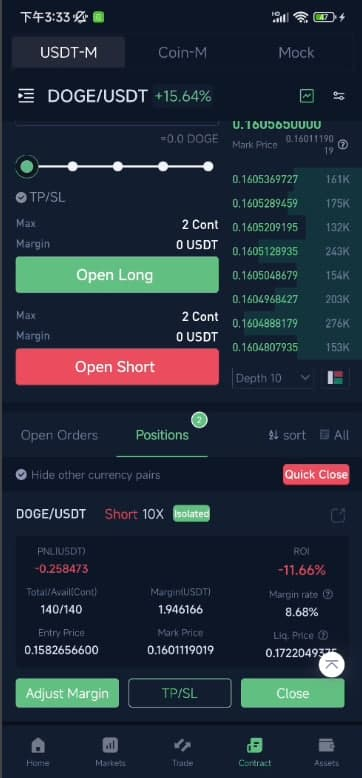
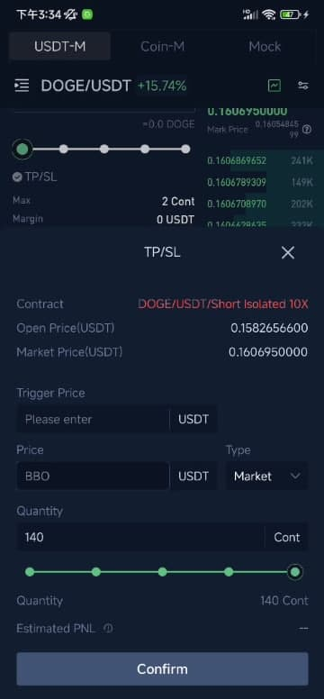
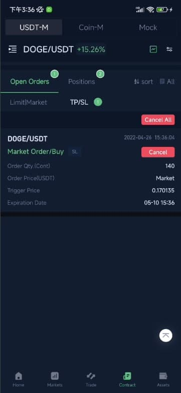

# Take Profit, Stop Loss TP/SL

## What is a Take Profit Stop loss order?

Take Profit Stop Loss Order: setting the trigger price and order parameters in advance, wherein the trigger price is the precondition for placing an order operation, generally the target Take Profit Stop Loss position, when the market's latest trade price reaches the trigger price, the system will be set by the user to place an order in accordance with the order parameters to close the position, in order to preserve profits or reduce losses.

Depending on the type of order executed after TP/SL is triggered, the Take Profit stop loss order is divided into:

- Limit Take Profit Stop Loss
- Market Take Profit Stop Loss

## Limit Take Profit Stop Loss

Limit Take Profit Stop loss requires the following parameters to be set:

- Trigger price
- Order price
- Order quantity

After the limit TP/SL is triggered, the next limit order is issued, which specifies the maximum price the user is willing to buy or the lowest price they are willing to sell. After the user sets the limit price, the market will reach the price in a favorable direction to the priority of the transaction, which means that the limit order may not be able to close immediately.

**Limit Take Profit Stop Loss Benefits**

After triggering, it can ensure that the transaction price is within the limit price, and the sliding point can be controlled.

**Limit Take Profit Stop Loss Disadvantage**

It will not necessarily close the transaction.

**Use tips**

In order to increase the probability of closing at limit take profit and loss, we generally do not set the order price and the trigger price the same, but instead reserve a portion of the sliding area. For example: long position take profit, the trigger price is $60,000, the order price can be set to $59,900, because a short order of $59,900 in the $60,000 market is easier to trade!

***_Example_***

See the "Example" section of this article

## Market take profit stop loss

Market Take Profit Stop Loss requires the following parameters to be set:

- Trigger price
- Order quantity

After the market take profit stop loss is triggered, the next market order will be placed at the optimal price at the time, to help the user close the transaction quickly.

## Market Take Profit Stop Loss Advantage

A deal can be completed immediately after triggering.

## Market Take Profit Stop Loss Disadvantage

There is no guarantee of a closing price, a large position or a market with poor liquidity may result in a large slippage.

***_Example_***

See the "Example" section of this article

## Summary

Limit/market prices have advantages and disadvantages. Follow these recommendations for better TP/SL effect:

- Take Profit choose Limit Price, this can Guarantee a Profit;
- Stop Loss choose market price, this can be quickly traded;
- For a small position choose market price;
- For large positions choose limit or market prices in batches of Take Profit Stop Loss;
- In irregular liquidity markets select limit price;

## The execution logic of a Take Profit stop order

The main parameters of a Take Profit Stop Loss order are:

- Position
- Trigger price
- Order price/market price
- Order quantity

The life cycle of a Take Profit stop loss order is divided into:

- Pending trigger
- Trigger successful/trigger failed
- After successful trigger, place order

**Pending trigger**

After a Take Profit Stop loss order has been successfully submitted, this Take Profit Stop loss order is in the "pending trigger" state! TP/SL orders will appear in the [Schedule Order List]. A Take Profit Stop order is a balancing order, so the TP/SL order direction of a long position is 'Sell Long', and the TP/SL order direction of a short position is 'Buy Short'.

\*Every planned order is a mechanism that can only be triggered once, and when the market price reaches the trigger price, it is triggered.

\*Each Take Profit stop loss order has an expiration date, the default is 14 days, and the user can make changes in the trading settings. After the expiration date, if this Take Profit stop loss order has not yet been triggered, it will be cancelled!

**Trigger rules**

TP/SL orders are triggered when the market's latest trade price meets the following criteria.

|                            | Take Profit                     | Stop Loss                                                         |
| -------------------------- | ------------------------------- | ----------------------------------------------------------------- |
| Long Position (Sell long)  | Latest close price>=burst price | Latest close price<=burst price & Latest close price - Mark price / mark price < anti-pin threshold |
| Short Position (Buy short) | Latest close price<=burst price | Latest close price>=burst price & Latest deal price - Mark price  / mark price < anti-pin threshold |

\*Stop loss anti pin mechanism

In unstable liquidity markets, market transactions can result in abrupt changes, which are detrimental to stop loss orders. In this regard, we have added a stop loss anti-pin mechanism.

In the market, the marked price is not affected by this abrupt changes, when the latest transaction price deviates from the mark price > 10%, can be determined as a big change, these large deviation transaction will not trigger stop loss orders.
```
1.Pin determination rules:
 (the latest transaction price - mark price) / Mark price > the anti-pin threshold

2.Pin-proof threshold = 10%
```

Please note:

- Take Profit orders are not protected because the openings at the time of the pin may be in Profit's favor.
- Pins up to 10% are not protected because price deviations of less than 10% are likely to be normal and do not belong to the abrupt change.

\*Being taken over by a strong balancing causes the trigger to fail

When the market volatility is very strong and the stop-loss price is closer to the strong closing price, although the above trigger rules are met, at the time of triggering, the position is likely to have been/is being taken over by the strong closing engine, resulting in a trigger failure!

**Order after trigger**

When Take Profit stop loss is triggered, the system immediately submits the order to the opening in accordance with the order parameters. The order parameters are as follows:
- Order direction: closing direction (opposite direction of position)
- Order price: Limit Take Profit Stop loss is 'order price';
- Order quantity: Min (number of open positions at trigger, 'number of orders' in Take Profit stop loss order)

At this point, you can see the order in the [Current Order List] or the [Historical Order List].

*It is possible to align the quantities.

The user may manually close the position after setting the Take Profit stop loss. When a position has a closing order, take profit stop loss can only trigger the remaining closing part!

## Example

**Limit Take Profit scenario**

On March 5, 2021, BTC broke through $50,000, and I chased up 10 BTC's multiple positions, opening at $50,000. My target take profit position is $60,000, and I'm used to take profit in batches, so I set up a take profit order at $58,000 and $60,000, respectively, with the following parameters:

Take Profit Order 1
```
1 Trigger price: 58,000 USDT
2 Order price: 57900 USDT
3 Order quantity: 5 BTC
```
Take Profit Order 2
```
1 Trigger price: 60,000 USDT
2 Order price: 60,000 USDT
3 Order quantity: 5 BTC
```

Subsequently, BTC, as I wish, continued to rise strongly, breaking through $58,000 on March 13 and accelerating to $60,000 on March 14, reaching a maximum of $60,020, but did not stand firm, breaking through quickly after the break-down, leaving a pin.

On March 15th I went to check my position and found the following:
* Both Take Profit Order 1 and Take Profit Order 2 have been triggered;
* I also hold 5 BTC long positions without take profit;
* My current order has a pending order, the order price is 60000, there is no transaction;

That is, only Take Profit Order 1 is traded and Take Profit Order 2 is not traded.

This is normal, because BTC reached $60,000, take profit orders are triggered, the system immediately began to place take profit orders, but during the order period, the market price has fallen below $60,000, to sell the price limit order although down, but above the market, cannot be traded!

So, I got the experience: when limit take profit stop loss, in order to increase the probability of closing limit orders, generally do not set the order price and trigger price to the same, but set a portion of the sliding area. For example: multi-position take profit, the trigger price is $60,000, the order price can be set to $59,900, because a short order of $59,900 is easier to trade in the near $60,000 market!

**Market Stop Loss scenario**

On March 14, 2021, BTC strongly broke through $60,000, I took out all the exchanges when chasing up 1000 BTC multi-position, opened the price at $60,000, to obtain the target $100,000. But in order to stabilize, I set a market stop order of $54,000, the parameters are as follows:

rigger price: 54,000 USDT

Order quantity: 1000 BTC

Then BTC failed me and went all the way down to $54,000 on March 23.
On March 24th I went to check my position and found that:
* My position is completely closed;
* From the historical order, it can be seen that the average closing price of the 1000 BTC is $53,600, not $54,000;

That is, although the stop loss, but I suffered a relatively large slippage.

So, I got the experience: a large position should not use market price full closing to stop loss, it is better to use batch stop loss or limit stop loss.

## How to set stop profit and loss

**Set the stop profit stop loss entry**

On the page of app terminal user's position holding, a pop-up box with stop profit and loss setting appears after "stop profit and stop loss". 



**Set stop profit and loss**

- a) Select "Open stop profit" "Open stop Loss"
- b) Trigger price. When the latest market price reaches the set trigger price, the system will submit stop profit/stop loss orders according to the set order price and quantity.  

Multi-position stop-profit trigger price: trigger price ≥ latest price;
 
Long stop loss trigger price: strong flat price ≤ trigger price ≤ latest price;
 
Short stop-profit trigger price: trigger price ≤ latest price;
 
Short stop-loss trigger price: strong flat price ≥ trigger price ≥ latest price.

- c) Commission price, the listing price in the market at the time of commission.

Limit order: can lock the final transaction price, but in the stop loss is prone to stop the situation;

Market price entrustment: after triggered, the transaction can be done quickly. The final transaction price of market price entrustment may slip, so that the final profit or loss can not be determined.

Note: Please set the appropriate commission price according to your own trading strategy.

- d) Number of orders, the number of system orders after being triggered. If you want to stop profit and loss of all positions, you need to set the same number as the open position.  

- e) Click "Confirm" and the stop profit/stop loss will be set successfully.  



**Check the stop profit and stop loss orders**

Stop-profit orders can be viewed in the stop-profit and stop-loss section. 


