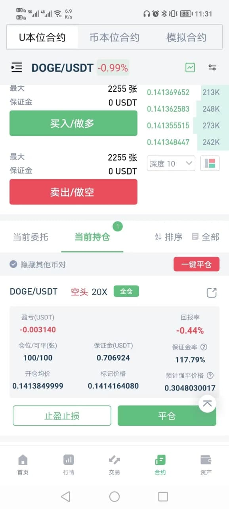
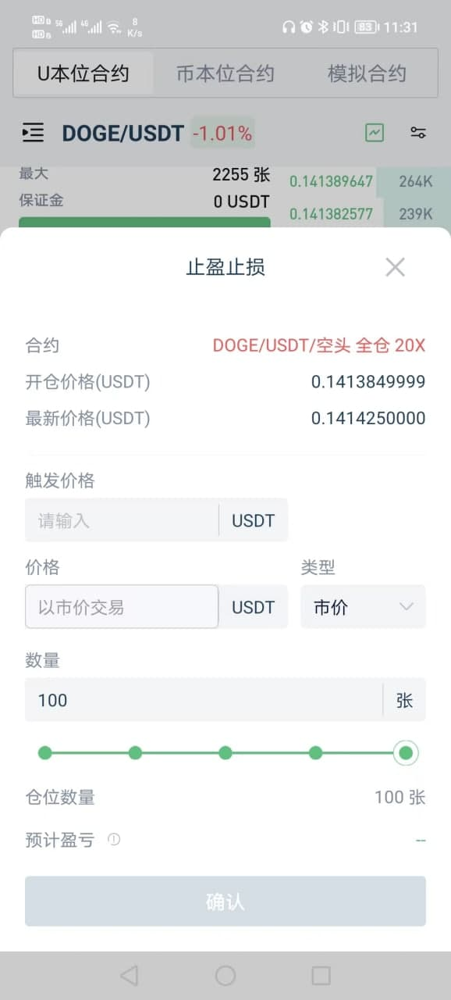
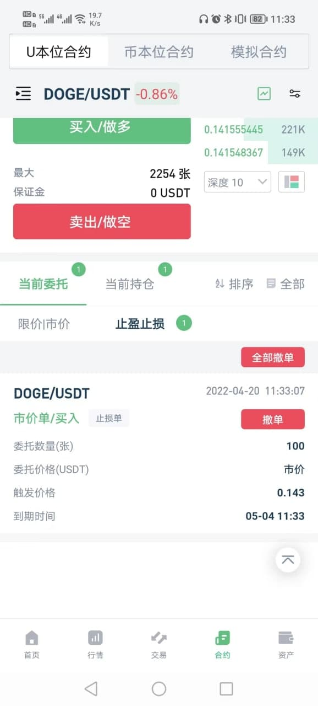

# 止盈止损

## 什么是止盈止损单？

止盈止损单是指：事先设置好触发价和委托参数，其中触发价是进行下单操作的前置条件，一般是目标止盈止损位置，当市场的最新成交价到达触发价时，系统就会按照用户设置的委托参数下单进行平仓，以保住利润或减少损失。

根据止盈止损单触发后执行的委托类型不同，止盈止损单分为：

- 限价止盈止损
- 市价止盈止损

## 限价止盈止损

限价止盈止损需要设置以下参数：

```
1.触发价格
2.委托价格
3.委托数量
```

限价止盈止损触发后会下一个限价单，限价单规定了用户愿意买的最高价格或愿意卖的最低价格。用户在设定限价后，市场会以达到对有利方向的价格优先成交，这就意味着，限价单不一定能立即成交。

**限价止盈止损优点**

触发后能保证成交价格在限价之内，滑点可控。

**限价止盈止损缺点**

不一定能成交。

**\*使用技巧**

为了提高限价止盈止损的成交几率，我们一般不会把委托价格和触发价格设置为一样，而是会预留一部分滑点区域。如：多仓止盈，触发价是 60000 美金，委托价可设为 59900 美金，因为一个 59900 美金的空单在 60000 美金的盘口中更容易成交！

**\*案例**

见文章“案例”部分

## 市价止盈止损

市价止盈止损需要设置以下参数：

```
1.触发价格
2.委托数量
```

市价止盈止损触发后会下一个市价单，市价单会以当时盘口最优价格下单，帮助用户快速成交。

**市价止盈止损优点**

触发后能立即成交。

**市价止盈止损缺点**

不能保证成交价格，大仓位或在流动性欠佳的市场中，可能造成较大滑点。

**\*案例**

见文章“案例”部分

## 总结

限价/市价各有优缺点。遵循以下建议，可得到更好的止盈止损效果：

- 止盈选限价，能保证利润；

- 止损选市价，能快速成交；

- 小仓位选择市价；

- 大仓位选择限价或市价分批止盈止损；

- 流动性欠佳的市场选择限价；

## 止盈止损单的执行逻辑

止盈止损单主要参数有：

```
1.仓位
2.触发价格
3.委托价格/市价
4.委托数量
```

一个止盈止损单的生命周期分为：

```
1. 待触发
2. 触发成功/触发失败
3. 触发成功后下单
```

**1. 待触发**

一个止盈止损单提交成功之后，这个止盈止损单处于“待触发”的状态！这个状态的止盈止损单会显示在【计划委托列表】中。止盈止损单是平仓单，故多仓的止盈止损单方向是‘卖出平多’，空仓的止盈止损单方向是‘买入平空’。

\*每一个计划委托就像一个只能触发一次的机关，当市场价格到达了触发价后，这个机关就会被触发。

\*每个止盈止损单都有一个过期日期，默认 14 天，用户可在【交易设置】中进行更改。过期日期之后，如果这个止盈止损单仍未被触发，那么它就会被取消！

**2. 触发规则**

当市场的最新成交价满足以下条件时，止盈止损单就会被触发。

|                      | **止盈**           | **止损**                                                             |
| -------------------- | ------------------ | -------------------------------------------------------------------- |
| **多仓（卖出平多）** | 最新成交价>=触发价 | 最新成交价<=触发价 &amp; \(最新成交价-标记价格\)/标记价格<防插针阈值 |
| **空仓（买入平空）** | 最新成交价<=触发价 | 最新成交价>=触发价 &amp; \(最新成交价-标记价格\)/标记价格<防插针阈值 |

\*止损防插针机制

_在流动性不足的市场，市价成交可能会造成插针，这种情况的插针对止损单是不利的。对此，我们增加了止损防插针机制。_ 在市场中，标记价格不受插针的影响，当最新成交价偏离标记价格>10%时，可判定为插针，这些偏离过大的成交不会触发止损单。

```
1. 插针判定规则：
(最新成交价-标记价格) / 标记价格 > 防插针阈值
2.防插针阈值 = 10%
```

_请注意：_

1.  止盈单不受此保护，是因为插针时的盘口有可能对止盈有利。
2.  10%以内的插针不受保护，是因为 10%以内的价格偏离很可能是正常的，不属于插针。

\*被强平接管导致触发失败

当行情波动很剧烈并且止损价格距离强平价格较近时，虽然满足以上触发规则，但在触发时，仓位很可能已经/正在被强平引擎接管，会造成触发失败！

**3. 触发后下单**

当止盈止损触发后，系统会立即按照委托参数向盘口提交委托。委托参数如下：

```
1. 委托方向：平仓方向（仓位的反方向）
2. 委托价格：限价止盈止损是‘委托价格’；市价止盈止损是市价
3. 委托数量：Min（触发时的可平仓位数量，止盈止损单中的‘委托数量’）
```

这个时候，你能在【当前委托列表】或【历史委托列表】中看到委托的订单。

\*可平数量对齐

用户可能在设置止盈止损后，再手动挂平仓单进行平仓。当仓位有平仓单的时候，止盈止损只能触发剩余可平部分！

## 案例

**限价止盈场景**

2021 年 3 月 5 日，BTC 强势突破 50000 美金，我追涨开了 10 BTC 的多仓，开仓价格是 50000 美金。我的目标止盈位置是 60000 美金，我比较习惯分批止盈，所以我在 58000 美金和 60000 美金分别设置了一个止盈单，参数如下：

止盈单 1

```
1 触发价格：58000 USDT
2 委托价格：57900 USDT
3 委托数量：5 BTC
```

止盈单 2

```
1 触发价格：60000 USDT
2 委托价格：60000 USDT
3 委托数量：5 BTC
```

随后，BTC 如我所愿，继续强势上涨，在 3 月 13 日突破 58000 美金，并在 3 月 14 日加速上涨突破 60000 美金，最高达到 60020 美金，但没有站稳，突破后快速回落，留下一根针。

3 月 15 日我去检查我的仓位，发现：

1. 止盈单 1 和止盈单 2 都已被触发；
2. 我还持有 5 BTC 的多仓没有止盈；
3. 我的当前委托中有一个挂单，委托价格是 60000，完全没有成交；

也就是说，只有止盈单 1 成交了，止盈单 2 没有成交。

这是正常现象，因为 BTC 在到达 60000 美金时，止盈单被触发，系统立即开始下止盈单，但在下单期间，盘口价格已经回落至 60000 美金下方，60000 美金卖出平多的限价单虽然下下去了，但是在盘口上方，无法成交！

于是我得到了经验：限价止盈止损时，为了提高限价单的成交几率，一般不要将委托价格和触发价格设置为一样，而是预留一部分滑点区域。如：多仓止盈，触发价是 60000 美金，委托价可设为 59900 美金，因为一个 59900 美金的空单在 60000 美金附近的盘口中更容易成交！

**市价止损场景**

2021 年 3 月 14 日，BTC 强势突破 60000 美金，我拿出了全部家当追涨开了 1000 BTC 的多仓，开仓价格是 60000 美金，目标看到 100000 美金。但为了稳一些，我设置了 54000 美金的市价止损单，参数如下：

```
1. 触发价格：54000 USDT
2. 委托数量：1000 BTC
```

随后，BTC 辜负了我，一路萎靡，终于在 3 月 23 日跌破 54000 美金。

3 月 24 日我去检查我的仓位，发现：

```
1. 我的仓位完全平掉了；
2. 从历史委托中看到，这 1000 BTC 的平仓均价为 53600 美金，不是 54000 美金；
```

也就是说，虽然止损了，但我遭受了比较大的滑点。

于是我得到了经验：很大的仓位不要使用市价全平来止损，最好使用分批止损或限价止损。

## 如何设置止盈止损

**1、 设置止盈止损入口**

app 端用户持仓页面，「止盈止损」后出现止盈止损设置的弹框。



**2、 设置止盈止损**

- a) 选择「开启止盈」「开启止损」
- b) 触发价格，当市场最新价格达到设置的触发价格时，系统将按照设置的委托价格和数量提交止盈/止损委托。

多仓止盈触发价格：触发价格 ≥ 最新价格；

多仓止损触发价格：强平价格 ≤ 触发价格 ≤ 最新价格

空仓止盈触发价格：触发价格 ≤ 最新价格；

空仓止损触发价格：强平价格 ≥ 触发价格 ≥ 最新价格。

- c) 委托价格，委托价格时在市场上的挂单价格。

限价委托：能够锁定最终成交价格，但是在止损中容易出现止损失败的情况；

市价委托：触发后能够快速成交，市价委托最终成交价格可能会发生滑点，使最终收益或者损失不能够确定。

注：请您根据自己的交易策略设置合适的委托价格。

- d) 委托数量，被触发后系统委托的数量， 如果想把全部仓位止盈止损则需要设置与持仓一致的数量。
- e) 点击「确认」提交成功后则仓位止盈/止损设置成功。



**3、 查看止盈止损委托**

设置的止盈止损委托可在「止盈止损」中进行查看。


